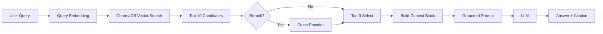

# Architecture — RAG Pipeline (Day 08 Lab)

> Template: Điền vào các mục này khi hoàn thành từng sprint.
> Deliverable của Documentation Owner.

## 1. Tổng quan kiến trúc

```
[Raw Docs]
    ↓
[index.py: Preprocess → Chunk → Embed → Store]
    ↓
[ChromaDB Vector Store]
    ↓
[rag_answer.py: Query → Retrieve → Rerank → Generate]
    ↓
[Grounded Answer + Citation]
```

**Mô tả ngắn gọn:**
Hệ thống là một trợ lý nội bộ thông minh cho khối CS và IT Helpdesk, cho phép tra cứu nhanh các chính sách, quy trình và SLA từ các tài liệu nội bộ. Hệ thống sử dụng kiến trúc RAG (Retrieval-Augmented Generation) để đảm bảo câu trả lời chính xác, có dẫn nguồn và hạn chế tình trạng ảo giác của AI.

---

## 2. Indexing Pipeline (Sprint 1)

### Tài liệu được index
| File | Nguồn | Department | Số chunk |
|------|-------|-----------|---------|
| `policy_refund_v4.txt` | policy/refund-v4.pdf | CS | 6 |
| `sla_p1_2026.txt` | support/sla-p1-2026.pdf | IT | 5 |
| `access_control_sop.txt` | it/access-control-sop.md | IT Security | 7 |
| `it_helpdesk_faq.txt` | support/helpdesk-faq.md | IT | 6 |
| `hr_leave_policy.txt` | hr/leave-policy-2026.pdf | HR | 5 |

### Quyết định chunking
| Tham số | Giá trị | Lý do |
|---------|---------|-------|
| Chunk size | 400 tokens | Cân bằng giữa việc giữ đủ ngữ cảnh và tránh làm loãng thông tin. |
| Overlap | 80 tokens | Đảm bảo không mất thông tin tại ranh giới giữa các chunk. |
| Chunking strategy | Section-based + Size-based | Ưu tiên cắt theo heading "=== Section ===" để giữ tính toàn vẹn của điều khoản, sau đó mới cắt theo kích thước nếu section quá dài. |
| Metadata fields | source, section, effective_date, department, access | Phục vụ filter, freshness, citation và kiểm soát quyền truy cập. |

### Embedding model
- **Model**: OpenAI `text-embedding-3-small` (1536 dimensions)
- **Vector store**: ChromaDB (PersistentClient)
- **Similarity metric**: Cosine

---

## 3. Retrieval Pipeline (Sprint 2 + 3)

### Baseline (Sprint 2)
| Tham số | Giá trị |
|---------|---------|
| Strategy | Dense (embedding similarity) |
| Top-k search | 10 |
| Top-k select | 3 |
| Rerank | Không |

### Variant (Sprint 3)
| Tham số | Giá trị | Thay đổi so với baseline |
|---------|---------|------------------------|
| Strategy | Hybrid (Dense + BM25) | Kết hợp vector search và keyword search. |
| Top-k search | 10 | Giữ nguyên để so sánh công bằng. |
| Top-k select | 3 | Giữ nguyên. |
| Rerank | Không | Chưa áp dụng. |
| Query transform | Không | Chưa áp dụng. |

**Lý do chọn variant này:**
Chọn hybrid vì tập tài liệu (corpus) chứa nhiều thuật ngữ chuyên ngành, mã lỗi (như ERR-403) và tên viết tắt (SLA, P1). Hybrid retrieval giúp cải thiện khả năng tìm kiếm chính xác khi người dùng sử dụng các từ khóa cụ thể này, đồng thời vẫn giữ được khả năng tìm kiếm theo ngữ nghĩa của dense search.

---

## 4. Generation (Sprint 2)

### Grounded Prompt Template
```
Answer only from the retrieved context below.
If the context is insufficient to answer the question, say you do not know and do not make up information.
Cite the source field (in brackets like [1]) when possible.
Keep your answer short, clear, and factual.
Respond in the same language as the question.

Question: {query}

Context:
[1] {source} | {section} | score={score}
{chunk_text}

[2] ...

Answer:
```

### LLM Configuration
| Tham số | Giá trị |
|---------|---------|
| Model | `gpt-4o-mini` |
| Temperature | 0 (để output ổn định cho eval) |
| Max tokens | 512 |

---

## 5. Failure Mode Checklist

> Dùng khi debug — kiểm tra lần lượt: index → retrieval → generation

| Failure Mode | Triệu chứng | Cách kiểm tra |
|-------------|-------------|---------------|
| Index lỗi | Retrieve về docs cũ / sai version | `inspect_metadata_coverage()` trong index.py |
| Chunking tệ | Chunk cắt giữa điều khoản | `list_chunks()` và đọc text preview |
| Retrieval lỗi | Không tìm được expected source | `score_context_recall()` trong eval.py |
| Generation lỗi | Answer không grounded / bịa | `score_faithfulness()` trong eval.py |
| Token overload | Context quá dài → lost in the middle | Kiểm tra độ dài context_block |

---

## 6. Diagram (tùy chọn)

> TODO: Vẽ sơ đồ pipeline nếu có thời gian. Có thể dùng Mermaid hoặc drawio.


